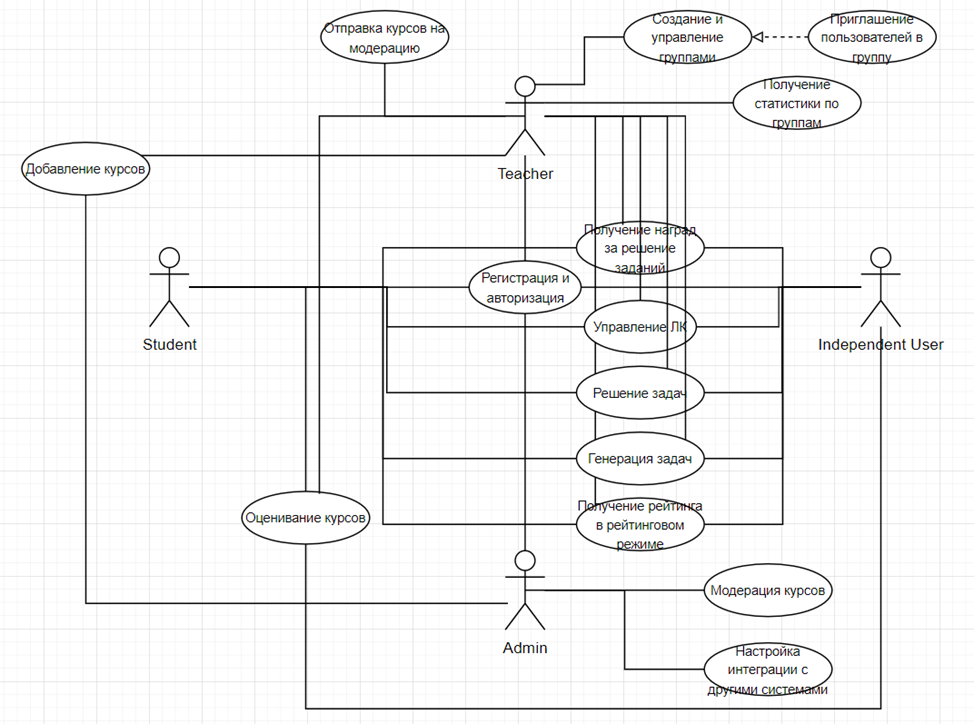

1) Перечень стейкхолдеров:
- Ученики (пользователи): школьники или студенты, которые будут использовать систему для изучения математики в геймифицированной форме.
Интерес: получение знаний, повышение мотивации и участие в игровом процессе.
- Учителя: преподаватели, организующие обучение через систему.
Интерес: использование платформы для преподавания, отслеживание прогресса учеников.
- Самостоятельные пользователи.
Интерес: соревнование с другими пользователями, изучение математики (например, для подготовки к экзаменам или собеседованию)
2) Перечень функциональных требований
- Должна быть реализована регистрация и авторизация пользователей.
- Должен быть личный кабинет с отображением пройденных курсов, достижения и статистики, рейтинг, настройки профиля.
- Должна быть реализована система очков, уровней и наград за выполнение заданий.
- Должна быть реализована возможность создания учебных групп.
- Должна быть реализована возможность добавления пользователей в группу по приглашению.
- Должна быть реализована возможность выгрузки статистики по студентам для преподавателей.
- Должна быть реализована возможность отправлять курсы на модерацию.
- Должна быть реализована возможность добавления преподавателями курсов.
- Должна быть реализован интерфейс для решения задач.
- Должна быть реализована система персонализированного подбора курсов на основе уровня знаний, интересов и предыдущего прогресса пользователя.
- Должна быть реализована генеративная модель для генерации заданий разного уровня сложности.
- Должна быть реализована генеративная модель для помощи с объяснением материала в случае возникновения трудностей.
- Должен быть реализован рейтинговый режим.
- Должна быть реализована возможность выбора тем заданий для последующей генерации «варианта».
- Должна быть реализована возможность оценивания курсов. 
- Должна быть реализована панель администратора для модерации курсов и обновления core-курсов.
- Реализация интеграции с внешними образовательными платформами и инструментами по необходимости.
3) Схема

4) Дополнительные требования (выдуманные)
- Система должна быть реализована до 01.09.2025
- Все пользователи (ученики, преподаватели и самостоятельные пользователи) будут иметь доступ к интернету для использования платформы. Платформа будет работать исключительно в онлайн-режиме.
- Платформа будет включать начальный (стандартный) набор курсов по математике, но будет позволять преподавателям добавлять дополнительные курсы по мере необходимости, что даёт гибкость в контенте.
- Для решения задач и получения наград пользователи могут взаимодействовать с платформой через веб-интерфейс, доступный на всех популярных браузерах.
- Все данные пользователей (рейтинг, статистика выполнения заданий и курсов) будут храниться в защищённом и доступном только для пользователя и администраторов виде.
- Ожидается, что система будет поддерживать несколько языков интерфейса, но начнёт с одного языка и постепенно добавит новые языковые версии по мере роста пользовательской базы.
- Для успешного функционирования системы, пользователи должны иметь минимальные технические навыки для работы с платформой, включая умение пользоваться интернетом, регистрацией и авторизацией.
- Для удобства пользователей будет разработано мобильное приложение, доступное для платформ iOS и Android, которое позволит пользователям изучать математику и решать задания в любом месте и в любое время, обеспечивая синхронизацию данных с основной веб-платформой.
5) Нефункциональные требования
- Требование к программной системе. Система должна обеспечивать быструю и эффективную работу, обеспечивая быстрый отклик на действия пользователя, включая загрузку страниц и выполнение заданий. Время отклика интерфейса не должно превышать 500 миллисекунд при стандартной нагрузке.
- Требования к программной системе. Система должна быть масштабируемой для обеспечения работы с 100'000 одновременных пользователей.
- Требование к программной системе. В случае сбоя одной из частей системы должна быть предусмотрена автоматическая миграция на резервные узлы с минимальным временем простоя (не более 5 минут).
- Требование к программной системе. Для баз данных должна быть настроена репликация данных между несколькими узлами для предотвращения потерь информации.
- Требование к программной системе. Внешние требования. Система должна поддерживать как веб-версии для ПК, так и мобильные приложения для платформы Android (7.0+), с синхронизацией данных между устройствами
- Требование к программной системе. Система должна поддерживать многоязычность, позволяя пользователям выбирать язык интерфейса из нескольких доступных опций (Русский, Английксий, Китайский).

